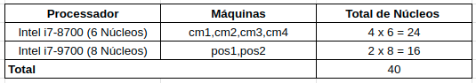
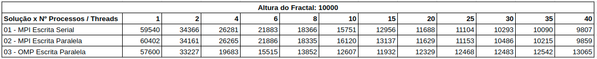
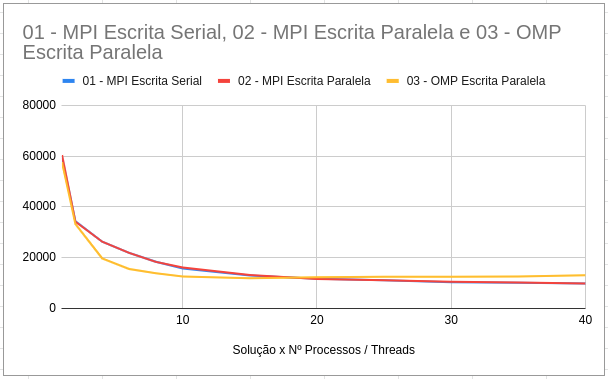

# PSPD - Lista MPI & OMP

## Problema 01: Fractal MPI - Escrita Serial

### Compilacão

```
make 
```

### Execução
```
make run <number-of-process> <fractal-height>
```

### Descrição da Solução

Para lidar com a escrita serial do arquivo (apenas um processo escreva por vez), foi adotado um esquema que compartilha um token entre os processos instanciados (baseado na abordagem de exclusão mútua). Além disso, cada processo possui um _offset_ de escrita diferente, assim evitando sobreescrita em regiões do arquivo que já foram calculadas. Para tanto, foram utilizados as funções de compartilhamento de janelas do MPI (_MPI_Win_create, MPI_Win_lock, MPI_Win_unlock, MPI_Fetch_and_op_, etc).

## Problema 02: Fractal MPI - Escrita Paralela

### Compilacão

```
make 
```

### Execução
```
make run <number-of-process> <fractal-height>
```

### Descrição da Solução

Para lidar com a escrita paralela do arquivo, foram utilizadas funções do MPI que permite a escrita de arquivos a partir de um _offset_. As funções utilizadas são as seguintes: _MPI_File_open, MPI_File_seek, MPI_File_write, MPI_File_close_.

## Problema 03: Fractal OMP - Escrita Paralela 

### Compilacão

```
make 
```

### Execução
```
make run <number-of-threads> <fractal-height>
```

### Descrição da Solução

A solução OMP utiliza um _scheduler_ dinâmico para dividir as tarefas de cálculo e escrita do fractal entre as _threads_. Um x atribuí tarefas a uma _thread_ conforme a sua disponibilidade, assim a distribuição de tarefas entre as _threads_ nem sempre vai ser exatamente igual. Além disso, a escrita do arquivo utiliza o conjunto de funções _posix_ (_open, pwrite, close_), onde a _pwrite_ permite a escrita paralela a partir de parâmetros de _offset_.

## Problema 04 - Relatório dos Problemas 1, 2 e 3

### Ambiente Chococino

A figura abaixo mostra a infraestrutura utilizada da chococino para realizar os testes. Dessa forma, temos à disposição 40 núcleos de processamento para lidar com as soluções em MPI.

<p align='center'>
    
</p>

### Testes

<p align='center'>
    
</p>

<p align='center'>
    
</p>

Observações:
* Altura dos fractais gerados: 10000
* A solução OMP (Open MP) foi executada em apenas uma máquina (cm1).
* Devido o desempenho ser bastante parecido, as linhas das soluções MPI com escrita serial e escrita paralela ficaram sobrepostas.

### Considerações

Foi possível notar as soluções MPI com escrita serial e escrita paralela possuem um desempenho bastante parecido. Quanto a solução em OMP, foi possível notar que, inicialmente, o desempenho melhora conforme o número de _threads_ aumenta, porém, quando o limite de 15 _threads_ é ultrapassado o desempenho começa a cair, assim atingindo o pico de performance com 15 _threads_.

## Referências

**MPI:**

- https://www.open-mpi.org/faq/?category=running
- https://docs.oracle.com/cd/E19923-01/820-6793-10/ExecutingPrograms.html
- https://www.ibm.com/docs/en/smpi/10.2?topic=runs-specifying-hosts-using-host-list-file

**Open MP:**

- https://nullprogram.com/blog/2017/03/01/